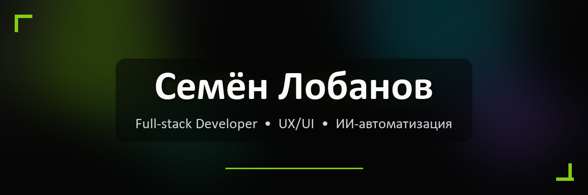

<div align="center">

<!-- Шапка-градиент. Текст ниже в markdown — так надёжнее для кириллицы -->


<h1>Привет, я Семён Лобанов</h1>
<p><b>Full-stack разработчик • UX/UI • ИИ-автоматизация</b></p>

</div>

<br>

<p align="center">
  <a href="mailto:lobanovsemyon474@gmail.com"></a>
  <a href="https://t.me/lobanovsemyon"></a>
  <a href="https://github.com/Lobanovs"></a>
  
</p>

<p align="center">
  <b>Создаю digital-продукты, которые масштабируют бизнес.</b><br>
  Лендинги, SaaS-интерфейсы, CRM, дашборды, парсеры и ИИ-автоматизация.
</p>

<br>

## 🧠 Чем я занимаюсь

Работаю как full-stack разработчик и продуктовый исполнитель: прохожу путь от структуры лендинга и CRM-логики до интерфейса, интеграций, Telegram-ботов, дашбордов и передачи проекта команде.

- **UX/UI и прототипирование** — Figma, дизайн-системы, интерактивные прототипы, User Flows
- **Frontend и интерактив** — React 19 / Next.js, TypeScript, Tailwind CSS v4, Framer Motion, Three.js / WebGL
- **ИИ и автоматизация** — OpenAI / Gemini API, n8n / Make.com, Telegram CRM-боты, вебхуки, авто-отчёты
- **Бэкенд и интеграции** — Python / Go / Java, REST / GraphQL, PostgreSQL / Redis, OAuth / JWT

> Фокус: сначала бизнес-логика и сценарии, затем дизайн и код. Говорю языком лидов, маржи, SLA и интеграций.

<br>

## 🚀 Избранные кейсы

Каждый кейс — это продуктовая модель с реальной механикой: проблема → решение → процесс → метрики.

| Проект | Сфера | Ключевой эффект |
| --- | --- | --- |
| 🤖 **ИИ-автоматизация стоматологии** | Медицина / CRM | Обработка заявки до 1 сек, нагрузка на ресепшн ↓30–45% |
| 📊 **Аналитика прибыли маркетплейсов** | E-commerce / Парсеры | Юнит-экономика по SKU, авто-флаг убыточных товаров |
| 🏠 **CRM с ИИ-скорингом для недвижимости** | Недвижимость | Ответ VIP до 2 мин, спам в воронке ↓50–80% |
| 🚚 **Дашборд логистической аналитики** | Логистика / Операции | Задержки ↓20–35%, контроль SLA по точкам и маршрутам |
| 🎓 **Кабинет студента EdTech с ИИ** | Образование | Нагрузка кураторов ↓40–60%, доведение курса ↑10–20% |
| 🏪 **Контроль качества сети филиалов** | Ритейл / Франчайзинг | Пропущенные звонки ↓50–80%, NPS по каждому филиалу |

<br>

## 🛠 Стек

<p align="center">
  
  
  
  
  
  
  
  
  
  
  
  
  
  
</p>

<br>

## 🔄 Как я работаю

```
Исследования и аналитика → Проектирование логики → Премиальный UX/UI
              ↓
Техническая сборка → Анимация и полировка → Запуск и передача
```

1. **Исследования** — разбираю цифры: конверсии, повторные покупки, время сотрудников, комиссии.
2. **Проектирование логики** — роли, статусы, CRM-триггеры, правила автоматизации.
3. **Премиальный UX/UI** — швейцарская типографика, выверенные отступы, тёмная премиальная эстетика, адаптив.
4. **Техническая сборка** — формулы, парсеры, API-клиенты, интерактивные графики.
5. **Анимация и полировка** — микро-анимации, шейдеры, custom-курсор, переходы.
6. **Запуск и передача** — чистые мокапы, спецификация, API-доки, без сюрпризов.

<br>

## 📈 Статистика GitHub

<p align="center">
  
  
</p>

<br>

## 📬 Связаться

<p align="center">
  <a href="mailto:lobanovsemyon474@gmail.com"></a>
  <a href="https://t.me/lobanovsemyon"></a>
</p>


<div align="center">
  
</div>
